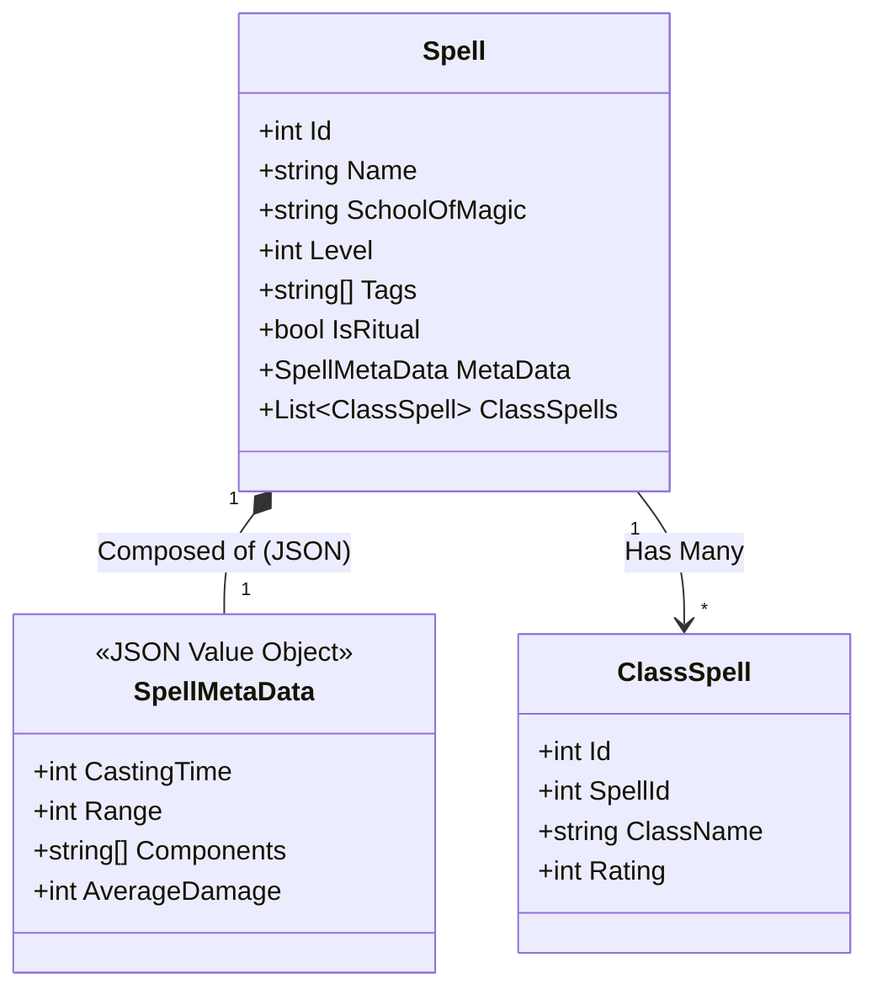

# Spellbook API (Backend)
> **Note:* This project is currently under development. Features and documentation are being continuously updated.

A RESTful API for managing Dungeons & Dragons 5e Spells.
Built with **ASP.NET Core** and **Entity Framework Core**, designed to handle complex filtering, pagination, and dynamic JSON data storage using PostgreSQL.

---

## Architecture
The project follows a clean architecture using **DTOs**, **Repository patterns** (via Extensions) and **Dependency Injection**. It leverages PostgreSQL's **JSONB** features to store dynamic spell metadata efficiently.

## Features
* Advanced Filtering: Filter by Level, School, Class, Source, Tags and Ritual status.
* JSON Querying: Deep filtering on JSON metadata (Range, Casting Time, Damage).
* Dynamic Sorting: Sort by Rating based on the selected Character Class context.
* Pagination: Optimized database queries with Skip/Take.
* Clean API: Returns optimized DTOs, avoiding over-fetching data.

## Tech Stack
* Framework: .NET 8 / ASP.NET Core Web API
* ORM: Entity Framework (Code-First)
* Database: PostgreSQL (Npgsql Provider)
* Documentation: OpenAPI / Swagger (Native Support)